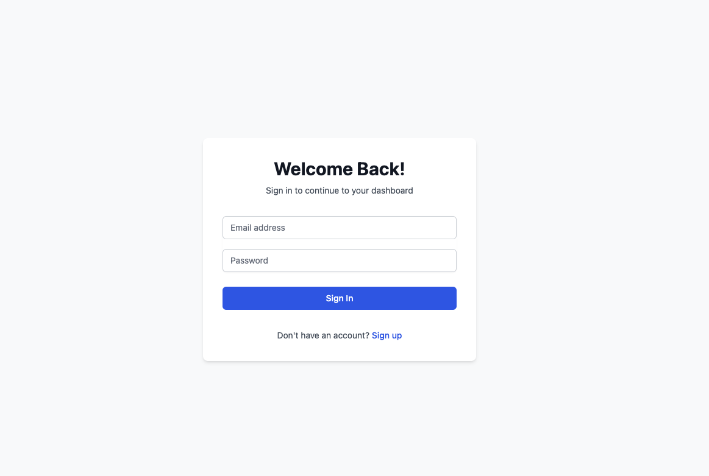
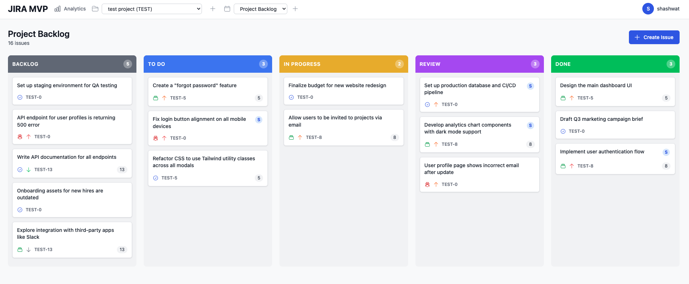
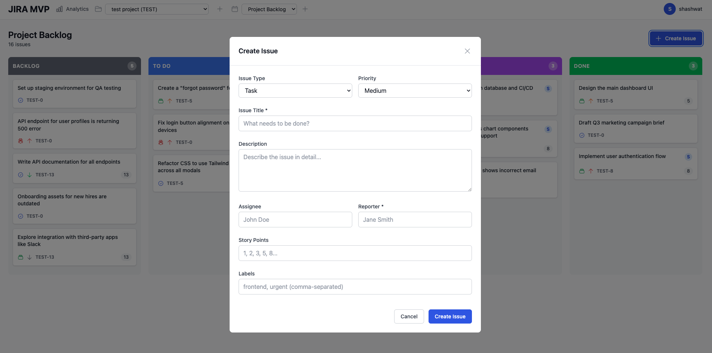
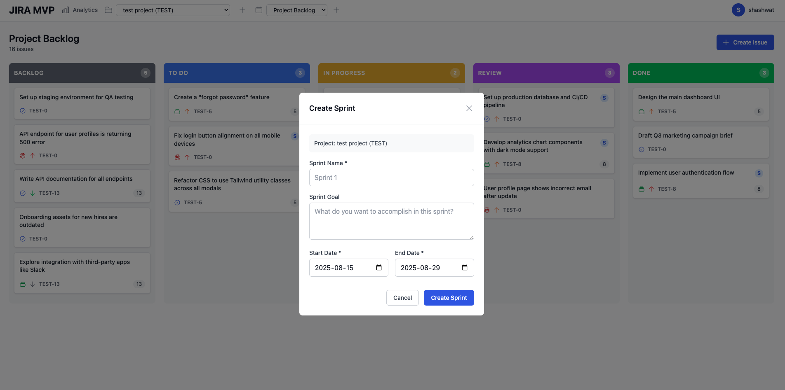
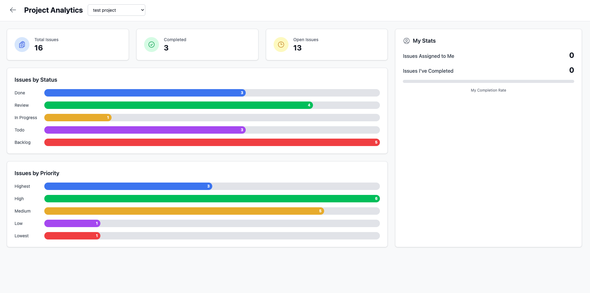

# JIRA MVP

A full-stack, minimal JIRA-like application built with the MERN stack and Next.js. This project features a fully functional Kanban board, project and sprint management, user authentication, and an analytics dashboard.




[create project](image-3.png)




-   **User Authentication:** Secure user registration and login with JWT and httpOnly cookies.
-   **Project Management:** Create and manage distinct projects.
-   **Sprint Planning:** Organize work into sprints within each project.
-   **Kanban Board:** A drag-and-drop interface to manage issues through different statuses (Backlog, To Do, In Progress, Review, Done).
-   **Issue Tracking:** Create, edit, and delete issues (Stories, Tasks, Bugs).
-   **Analytics Dashboard:** View key metrics for projects, including issue counts, status breakdowns, and personal performance stats.
-   **Dark Mode:** A sleek, user-toggleable dark theme for comfortable viewing.

## Tech Stack

**Frontend:**
-   **Next.js (React)**
-   **Tailwind CSS**
-   **Axios**
-   **@hello-pangea/dnd** (for drag-and-drop)

**Backend:**
-   **Node.js**
-   **Express.js**
-   **MongoDB** (with Mongoose)
-   **JSON Web Tokens (JWT)** for authentication

**Preview:** https://jira-mvp.netlify.app/login

## Getting Started

### Prerequisites

-   Node.js (v18 or later)
-   MongoDB Atlas account or local MongoDB instance

### Installation & Setup

1.  **Clone the repository:**
    ```sh
    git clone https://github.com/KWATRA55/JIRA-MVP.git
    cd JIRA-MVP
    ```

2.  **Install all dependencies:**
    This command will install dependencies for the root, server, and client.
    ```sh
    npm run install-deps
    ```

3.  **Set up environment variables:**
    Create a `.env` file in the root directory and add the following:
    ```
    MONGODB_URI=your_mongodb_connection_string
    JWT_SECRET=your_super_secret_jwt_key
    ```

4.  **Run the application:**
    This will start both the backend (on port 5001) and frontend (on port 3001) concurrently.
    ```sh
    npm run dev
    ```

Open [http://localhost:3001](http://localhost:3001) to view the app in your browser.
